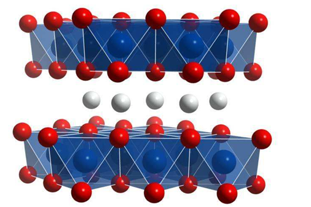

<!-- More -->

<video src="@qiniu/fury教程/2020电气组寒假培训/1.22_动力电池.m4v" controls>您的浏览器不支持video标签</video>

<!--  -->

## 目的

## 三电系统

- 电池
- 电机
- 电机控制器

## 动力电池分类

- 软包 (我们使用)
- 圆柱形 (18650)
- 方壳

## 模组 (Pack)

电池单体 (Cell) 的串并联

## 电池重要参数

### 电压

### 电流

### 容量

- Ah
- $$1Ah=1000mAh=1A \times 1h$$

### 能量

- kWh (度)
- $$W=Fx=mgx$$
- $$能量=容量 \times 电压$$
- $$20Ah \times 3.7V=74Wh$$

## 2020赛季电池参数

| 单体电压 | 3.7V                                          |
| -------- | --------------------------------------------- |
| 模组形式 | 16串 5模组串联=80串                           |
| 单体容量 | 22Ah                                          |
| 总能量   | $22Ah \times 80 \times 3.7V=6.512kWh=6.5度电$ |

