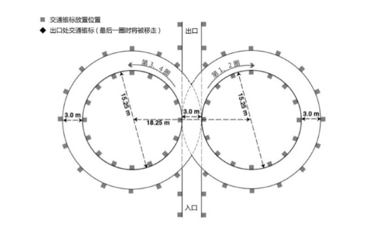
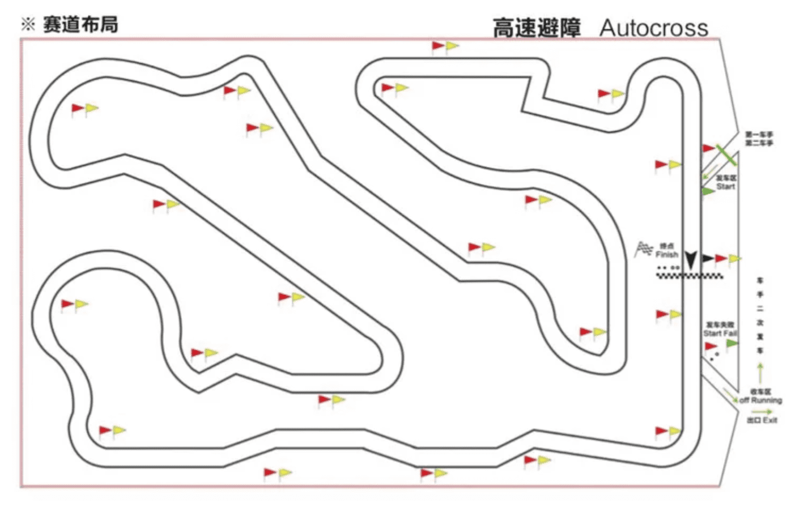
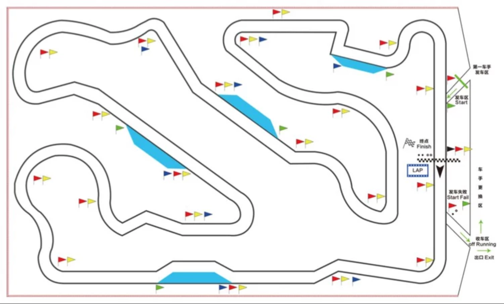

写这篇文章想为大家简单的介绍一下大学生方程式大赛设置的比赛项目和技术发展趋势，希望大家看我能够对比赛有一个简单的概念性的认识吧（笑

<!-- More -->

## 大学生方程式是一个什么样的赛车比赛呢

大学生方程式（下文简称FSAE）比赛不同于纯粹的商业化竞速赛车比赛，比赛将参赛车队设定为一个独立的**赛车制造公司**，比赛的评估项目在**竞速**之外还有对于整个团队在**运营管理**水平的量化评比。可以说是一个建立在真实汽车企业情境背景下的大型工程竞赛。

因此，参赛车队作为一个独立运营的赛车公司，它们需要在一年的赛季中完成以下任务：

- 制定完整的赛车产品的**商业计划**

- 设计并制造出一辆符合赛事规则要求的**赛车原型车**

- 完成车辆量产化的制造方案并进行**成本评估**

除了这些比赛规定的项目，在车队的正常发展的过程中，一个车队也一定需要面对这些问题：

- 如何解决过程中各种各样的**绝境bug**

- 如何制定短线与长线**发展策略**

- 如何根据车队生存环境制定**财务计划**

- 如何寻找**赞助爹**

- 如何制定企业品牌与**文化运营**策略（队徽队服，团建活动等）

- ~~如何在领导面前**吹牛[高雅]**~~

- 等等

因此，加入车队对同学们而言可以得到一个接近真实企业的工作经历，随着车队的壮大，还可以切身地体验技术型企业的发展历程。是不是很期待（媚

### 关于“比赛想要考察的内容”

同学们应该都有了解过目前大学生能接触到的比赛，相信不少的同学们也了解过赛车比赛，FSAE项目作为一个整合以上两个关键属性的比赛，在**世界范围内**已经形成了独立的成熟的比赛定位和规则体系。同时与所有比赛相同，面向大学生比赛的科研与工程教育性质永远是第一位的。

看完上面的的内容大家应该能够对这个比赛的内容产生了一个基本的概念。这个比赛在相对于纯粹的赛车竞速比赛，更加考验的是学生车队的**设计水平**与**管理水平**。相对于其他小队规模的工程实现比赛，这个比赛的无论从**学科整合**性，**时间跨度**还是**规范性要求**上都更高，更大，更长。相比于应变能力，更需要参赛同学形成**长期良好的工程习惯**，才能拿到更好的名次。

比赛情境完全模拟了社会上大部分技术企业的发展过程与工作环境，这也让大学生方程式项目成为有别于其他工程研发类比赛的高门槛项目。不仅是对人员技术与管理水平的考验，还是对**学校财力的考验**（捂。好了不吹了，请大家在参赛过程中慢慢体验吧（捂

## 世界范围内的FSAE比赛

目前在世界范围内共有包括美英德在内的约20多个国家与地区举办油车，电车，无人车分开评比的赛事。并且根据地区的不同形成了以德国赛规则驱动的欧洲地区比赛、以国际赛规则配合地方规则驱动的亚太和北美地区比赛。中国赛规则是赛事组委会与规则委员会为了匹配国内学校研发实力，因此将两份规则进行翻译后整合，并加入地区适应性规则形成

### 北美亚太地区与SAE国际赛规则

北美作为全世界最早开展FSAE比赛的地区,经历了从木板车到单体壳的发展过程。但是目前北美地区的车队顶尖水平不及欧洲地区。北美与亚太地区多使用美国赛会***Formula SAE***发布的赛事规则（简称“**国际赛规则**”），这套规则在美国、澳洲、日本韩国等地使用，地区赛会配合国内研发水平进行一定的地区规则调整。国内顶尖学校已经能够参加**日本赛**并取得非常不错的成绩，日本赛成绩也会慢慢成为正在进步的国内学校所追求的目标

*[Formula SAE](http://www.fsaeonline.com/)*

*[Formula SAE Japan -Monozukuri Design Competition](https://www.jsae.or.jp/formula/en/index.php)*

### 欧洲地区与*FSG*德国赛规则

以德国赛为首的欧洲地区是目前世界上工程研发能力最强的地区。围绕德国地区的很多学校依托其强大成熟的加工技术，高超的理论设计水平，以及学校与大型企业给予的有力经济与政策保障，使大量欧洲车队能够做到顶尖技术的掌握。同时依托欧洲成熟的赛车文化，欧洲地区的车队拥有一年多站的比赛机会。欧洲地区使用的***FSG***规则（简称“**德国赛规则**”）与国际赛规则目前大同小异。目前国内顶尖学校已经能够在政策支持下参加德国站比赛并跻身地球组。德国赛也成为了世界上不同国家的车队同场竞技的平台

*[Formula Student Germany](https://www.formulastudent.de/fsg/)*

### 中国赛与中国赛规则

中国赛油车赛始于2009年，电车赛始于2013年，无人车赛始于2017年。中国赛在世界范围内起步较晚，但依托近十年来国内经济高速发展的技术积累与顶尖学校的大量投入，目前的中国赛与中国车队已经有一定的技术水平。**中国赛规则**由两个国际规则的翻译整合，也慢慢形成了符合中国实际情况的赛事规则。但是中国赛在赛事流程规范性方面仍不及国外赛会，所以参加外国赛事仍然是目前中国车队的目标。因此我们要在适应地区特色的基础上努力做到规范自律，技术上实事求是，问心无愧，以实现国际规范为目标

[中国大学生方程式汽车大赛](http://www.formulastudent.com.cn/)

## 比赛规则与比赛项目

### 规则

赛事规则是方程式比赛的核心，**包括F1在内所有的方程式赛车比赛**都有明确的技术规则对赛车形式进行限定，并在赛前进行严格的技术检查以保证赛车符合条例。

FSAE中国赛规则由以下部分组成：

- *第一章  管理规定*

描述比赛进行的流程与管理条例。

- *第二章  通用技术规范*

对于赛车的**车架、车身、悬架、转向、传动、冷却、空气动力学套件等**基础设计进行技术限制。

- *第三章  替代车架规则*

有别于常规车架结构，组委会允许对钢管车架进行高度自由的设计，但是无法满足常规要求的车架设计需要提交额外的认证报告才可以使用。

- *第四章  内燃机车规则*

针对**油车**动力系统的安全性做出的技术限制。

- *第五章  电车规则*

对于**电车**动力系统的安全性做出的技术限制。

- *第六章  静态项目规则*

- *第七章  动态项目规则*

我准备用一篇专门的文章向大家粗略介绍下读规则的方法，在这儿就只要知道**规则很厚很细节**就好啦（笑

[2020中国赛规则 (答题版)](/2019/12/fury资料整理/fury资料整理/杂/大赛规则/2020中国大学生方程式大赛规则1203答题版.pdf)

[2020国际赛规则](/2019/12/fury资料整理/fury资料整理/杂/大赛规则/FSAE_Rules_2020_V2.1_国际赛.pdf)

[2020德国赛规则](/2019/12/fury资料整理/fury资料整理/杂/大赛规则/FS-Rules_2020_V1.0_德国赛.pdf)

### 车检

赛车在拿到动态赛的参赛许可之前必须通过全部的车检以证明赛车满足比赛的规则要求。车检的内容（电车）包括：

- **车手逃生测试**

所有参赛车手需要在**5秒之内**从座舱**完全逃出赛车**，未能完成的车手不允许参加动态比赛

- **机械检查**

对于规则第二章所描述的机械规范进行检查

- **电池箱检查**

对于电池箱机械与电气设计工程规范性进行检查

- **通电检查**

在**机械检与电池箱检通过之后**方可安装电池箱，进行整车**高低压通电**检查，以验证系统可靠性。

- **侧倾测试**

车辆停靠在侧倾台架上**侧倾60°**不能出现车轮离地与液体泄漏，验证赛车的侧向稳定性。

- **淋雨测试**

电车测试项目，电车上电后进行**120秒全方向淋雨**测试，以验证赛车电气绝缘性。

- **制动测试**

赛车在短暂加速过后需要在制动过程中**所有车轮抱死**方可通过测试，以验证赛车制动系统可靠性。

- **动态练习测试**

赛车需要通电并在规定场地内**自由行驶180秒**无异常，验证系统的可靠性。

想必大家都明白通过车检是一辆赛车取得比赛成绩的基础。然而需要注意的是，车检仍然是包括我们在内的车队参加比赛所遇到的**第一大考验**。遵守规则条例并最终成功通过车检对于由大学生组成的车队而言，是一项从基础设计阶段开始知道加工制造乃至车检进行时都需要**保持细心，保持坚定**的工作任务。看似简单的车检要求中隐藏着无数需要注意的**细节**。花费一年时间斥巨资打造的赛车因车检未通过而**无法取得动态成绩**抱憾而归的车队**不在少数**。因此这里特意将车检单独列作一项比赛项目。

在通过上述检查并完成动态赛后，赛车还将接受部分项目**复检**，以验证赛车可靠性。再次强调规则与车检是所有技术类工作需要面对的问题，也是一整年参赛过程中**大量矛盾的来源**。

### 比赛文件

参赛队伍需要在赛季内规定的ddl之前提交比赛要求的一些文件，有些文件用于车检，有些计入静态项目分数。它们包括但不限于：

- *商业逻辑方案*

- ***SES****结构等同性表格*/***SRCF****结构要求证明表*

- ***IAD****前端缓冲结构数据要求*

- *成本报告*

- *设计报告*

- *设计参数表*

- ***ESF****电气系统表*

- ***FMEA****失效模式及影响分析*

如果不能按时提交，技术检查文件将会影响车检，而计分类文件会在总成绩上扣除罚分。迟交同样有扣分处罚。

此外还有比赛要求提交的验证性文件，比如参赛人员名单等等。

### 赛车设计

**赛车设计（Engineering Design）**是一项评估赛车技术水平的静态项目，分值为**150/1000**。赛车设计项目要求车队提交一份有篇幅限制的**设计报告**用来简述赛车的技术特点。并且在比赛期间进行**设计答辩**来详细阐述赛车的设计理念并回答裁判的问题。项目的评分采用概念排名分制，即150分会按照裁判统一标准进行排名化计分。

需要大家认识的概念是：赛车设计项目中的设计亮点展示固然重要，但是得到高分更重要的是**对于赛车及其子系统的透彻认识**，并在这些理论基础上使设计思路与设计目标有**明确的逻辑关系**，有能力**展示数据**，向裁判充分展示思路的逻辑完备性，而非一味夸大吹水而无法自圆其说。

### 成本与制造分析

**成本与制造分析（Cost and Manufacturing）**是一项评估**赛车制造成本**与参赛团队**成本分析能力**的静态项目。分值为**100/1000**，为多项分项目的组合分数。其中包括：

- **总成本评分**     **20**分   最低成本比例换算后的排名分

- **现场陈述**      **40**分   答辩与成本报告的准确性评估

- **案例分析**      **40**分   解答比赛现场发布案例分析题目

成本与制造分析项目要求车队完成并提交一份完整的**物料清单（BOM）**以按照标准描述赛车制造流程的材料，工序等项目的成本。并且车队在比赛日现场会参加**成本答辩**，阐述赛车制造工艺，并现场回答“**案例分析**”问题。

可以看出，在成本报告的评分中，能够得到高分的队伍并非纯粹追求低成本或是高性价比思路。成本项目最重要的得分点其实是**统计的准确性**与所提出制造方案在逻辑上的**合理性**，与设计报告一样，只有成本**计算准确**，过程**严谨**并且**对制造工艺有着清晰的认识**才能得到成本报告的高分。

### 营销报告

**营销报告（Business Plan Presentation）**其实我更愿意称之为**商业报告**。为什么要特意称其为商业报告是因为该项目的考核重点实际上是对于车队制定的**商业计划**的评价~~，而不是金牌销售卖车吹水大会~~。得到高分的参赛队伍应该能够在**展示商业营销方案**的基础上，**提供足够的数据**以支持商业计划的合理性（比如市场调研），从而达到吸引投资方（裁判）的目的。营销报告的分值为**75/1000**，采用现场打分换算排名分的形式。

可以看到，三个静态项目的考核重点都不是简单的亮点展示，而是需要**有完整的内容支持**。每一项内容支持都明确地对同学们的竞赛态度有要求：**严谨完整，规范细心**。大家应该要认识到这是FSAE对于参赛同学**长久不变的要求**。

*静态项目到此为止↑，动态项目现在开始↓*

### 直线加速

**直线加速（Acceleration）**为赛车加速能力测试，赛道长度**75*m***铺装路面。分值为**75/1000**，计分模式为**排名换算分**，公式为：
$$
3.5+71.5\times\frac{\frac{全场最快圈速}{计分车圈速}-1}{1.50-1}
$$
可以看出完赛车队能够得到**3.5**分，而圈速在不低于全场最快圈速**150%**的车队将获得比例换算的得分。同时公式第二段下限为0，即最快车能够得到**75**分，后续车队得分递减至**3.5**分。

目前在世界范围内火星组车队已经能够做到**3.2*s***，中国赛最好成绩在**4*s***上下。

当然[***AMZ***](http://driverless.amzracing.ch/en)当年一秒五零百电车是电机80kw限功关掉以后做出来的

### 8字绕环

**8字绕环（Skid Pad）**为赛车**定圆弯**能力测试，赛道为两个定半径圆组成赛道，并计算左右方向最快单环时间取平均。

项目分值为**50/1000**，计分模式为**排名换算分**，公式为：
$$
2.5+47.5 \times \frac{\frac{全场最快圈速}{计分车圈速}-1}{1.25-1}
$$
公式意义与直线加速是一样的，在此不赘述。

### 高速避障

**高速避障（Autocross）**为**单圈计时赛**，赛道形式为**1*km***左右长度的**桩桶赛道**，赛道平均宽度**3*m***，由不同半径组合弯，蛇形绕桩与短直道组成，平均速度控制在**40*km/h***上下（地球组）。

项目分值为**150/1000**排名分，公式为：
$$
7.5+142.5 \times \frac{\frac{全场最快圈速}{计分车圈速}-1}{1.45-1}
$$
公式意义不再赘述。

### 耐久测试

**耐久测试（Endurance）**与**效率测试（Efficiency）**同时进行，体现在流程上为**22*km***耐力赛，即使用高速避障的赛道进行**多圈耐力赛**，比赛中途需要更换车手来完成前后半段各**11*km***的跑圈。

耐久赛分值为**300/1000**排名分，公式为：
$$
50+250 \times \frac{\frac{全场最快圈速}{计分车圈速}-1}{1.50-1}
$$
该公式意义不再赘述。在此基础上，未能完成耐久赛全部里程的车队将获得
$$
20 \times \frac{车队完成圈数}{耐久赛总圈数}
$$
的耐久赛得分。

### 效率测试

**效率测试（Efficiency）**测试赛车的**能效情况**，通过在赛车上安装赛会发放的电池能量计计算赛车在耐久项目中的能耗情况，并结合圈速计算效率分值，并对效率分值进行排名分。效率测试分值为**100/1000**

由于目前中国赛规则并没有给出电车使用的计算公式（无奈），这里给出德国赛规则使用的计分公式：
$$
100 \times \frac{\frac{0.1}{计分车效率因子}-1}{\frac{0.1}{全场最高效率因子}-1}
$$
其中效率因子为：
$$
\frac{全场达成完成效率测试队伍的最快圈速 \times 最快车耗能^2}{计分车即时圈速 \times 计分车耗能^2}
$$
因此，对于未达成效率测试要求的车队，同时在国际赛规则中未能达到最快车圈速**133%**范围的车队，将会得到**0**分的效率测试成绩。

意义可能有偏差，看不太懂的可以自行查阅国际赛规则。

## 大学生方程式前沿技术趋势

随着技术进步，现在的大学生方程式赛车已经吸收了大量高级别下放技术，这里主要想让同学们了解一下世界上的顶尖水平，认识差距(捂脸。不过在认识差距的同时也不应该妄自菲薄。不同的客观环境（比如资金）决定了不同的车队必然会有不同的极限与解决方式，能够尽力做到最好的车队才是NB车队。多多了解，追求极限吧。

以上漂亮话↑，接下来是一些热门的关键词与链接，大家自行查阅吧。。

[赛车：寻找大学生方程式的极限 2018 - 曾奕凯的文章 - 知乎]( https://zhuanlan.zhihu.com/p/53386194)

[FSAE空力原理（续）：空力野兽TUFast分析 - MedinC的文章 - 知乎](https://zhuanlan.zhihu.com/p/93140853)

[文献综述（伪） - 大学生方程式级电池管理系统 - 曾奕凯的文章 - 知乎](https://zhuanlan.zhihu.com/p/66999119)

[大学生方程式汽车大赛 - 知乎](https://www.zhihu.com/topic/20007766)

[【FSAE】非簧载式尾翼设计](https://www.bilibili.com/video/av78474123?from=search&seid=17441891475399336113)

**#大学生无人驾驶方程式大赛**

**#四电机**

**#碳纤维单体壳**

**#主动悬架系统**

**#多功能方向盘**

> 结尾扣题：希望大家看完这篇文章能了解到这个比赛的运作形式与现在在世界上的影响力，找到自己在车队里的方向和目标，帮助自己提升技术水平，也帮助车队早日踏上火星组的竞争舞台（想[高雅]吃）