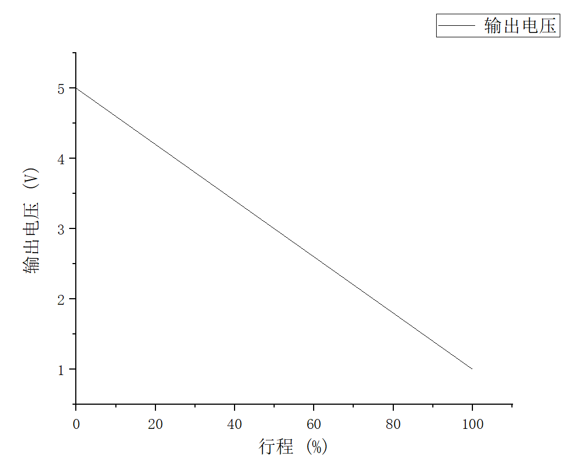

<!-- More -->

<video src="http://q4v73d4us.bkt.clouddn.com/fury教程/2020电气组寒假培训/第11讲.m4v" controls>您的浏览器不支持video标签</video>
## 刹车传感器

- 直线位移传感器，本质上是一个滑动变阻器

- 行程的变化对应阻值的变化
- 输入一个额定电压，将输出线连接至单片机，单片机采集输出电压来确定刹车踏板的深浅

## 油门传感器

- 采用节气门传感器，具体工作原理同上

## 低压系统主开关

- 低压系统主开关启动后，低压设备启动