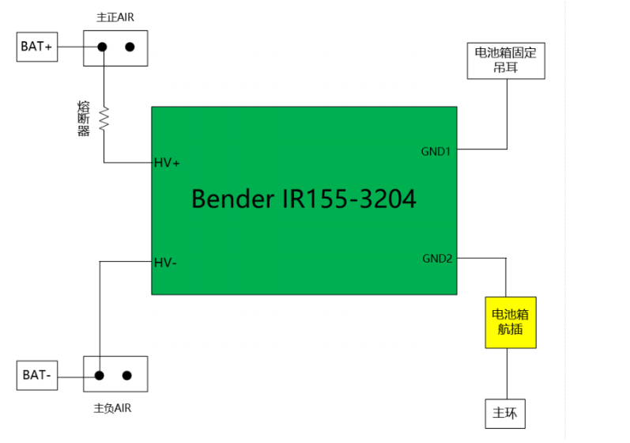
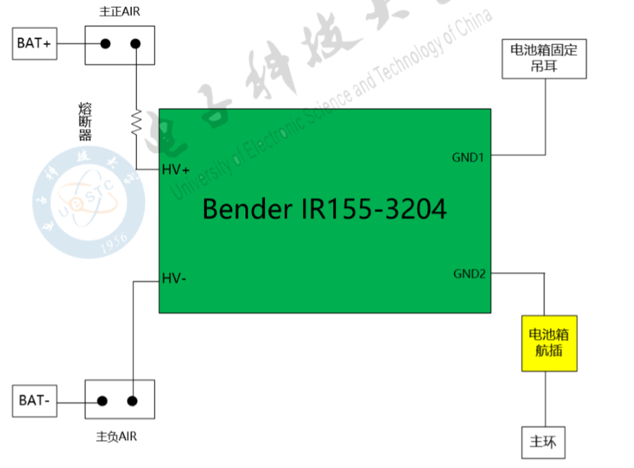

<!-- More -->

<video src="http://q4v73d4us.bkt.clouddn.com/fury教程/2020电气组寒假培训/第13讲.m4v" controls>您的浏览器不支持video标签</video>
## 搭铁

- 车架与低压GND相连

- 将低压电池的负极与车架相连，由于车架导电，因此所有低压元器件的GND线直接与车架相连即可

## 绝缘检测装置(IMD)

- 两个电气连接点之间电阻无穷大，称为绝缘
- 由于实际工程非理想情况，因此电阻大于一定值即可认为绝缘

> 7.4.3 当和驱动系统的最大工作电压关联时，绝缘检测装置的响应值需设定为小于等于 500Ω/V

$4.2V \times 80 \times 500Ω/V=168KΩ=0.168MΩ$

- 漏电指动力电池正负极与车架电阻过低
- 因此，漏电发生时，必须马上采取安全措施，断开安全回路

> 7.4.4 当发生绝缘故障或绝缘检测装置故障时，绝缘检测装置必须断开安全回路。这必须在不受任何 逻辑运算(如微控制器)的影响下完成。在绝缘故障发生后再次激活驱动系统的方法见第五章 7.1.6。

- （该图接线错误，2020版规则要求HV+和HV-两根高压检测线连接继电器输出侧）也就是如下图所示

  

- 当电池正负极和GND之间电阻过低时，该绝缘检测装置输出信号突变
- 正常情况下，该装置输出12V,绝缘故障时，输出9.3V

> 7.4.5 座舱内在显眼位置必须装配一个标识为“IMD”的红色的指示灯，当绝缘检测装置检测到一个绝 缘故障或自身故障时，指示灯必须点亮。指示灯在强烈阳光照射下必须清晰可见。控制这个指示的 信号是系统关键信号，见第二章 12.4。

- 由于漏电为整台车最危险的情况之一，因此专门采用醒目的指示灯指示绝缘故障