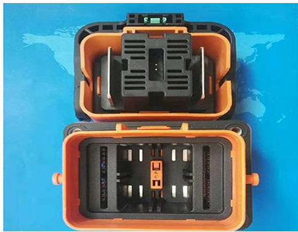

<!-- More -->

<video src="@qiniu/fury教程/2020电气组寒假培训/第七讲.m4v" controls>您的浏览器不支持video标签</video>
## 高压断开装置

- 如果两个AIR都发生粘连，那么由于无法接触到电池箱内部，会发生高压无法断开的风险

- 在车外，放置一个易于接触的，百分之百能断开高压的装置

- HVD分为插头插座，插座的两根螺柱连接高压线，当插头插座结合时，螺柱通过两个铜牌（插头）导通，当插头插座分离时，两个铜牌一定不会导通。

- 

- > 5.8.5 必须能够徒手移除 HVD。因此一个辅助接触点/互锁应当在 HVD 被移除的时候断开安全回路。

## 能量计

- 计算赛车的电能消耗，效率测试所用
- 能量计是赛会组委会下发的，以保证公平