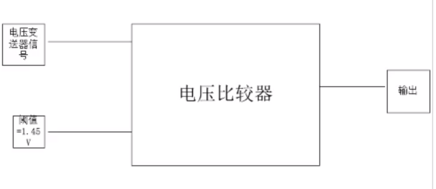

<!-- More -->

<video src="http://q4v73d4us.bkt.clouddn.com/fury教程/2020电气组寒假培训/第八讲.m4v" controls>您的浏览器不支持video标签</video>
## TSAL认为驱动系统激活的三个条件

- 任何一个AIR闭合（主正主负闭合其一）
- 预充继电器闭合
- 电池箱外的电压达到 60 V DC 

## 电控侧电压变送器

- 直接连接电控两端

- 防止HVD断开后，无法检测电控的电压

- 电压变送器将高压电转化为低压电—将60VDC转化为1.48V，当信号线的电压大于1.48V，灯红闪

  

## 电压比较器

- 当输入大于阈值，输出高电位；当输入小于阈值，输出低电位

- 实现将模拟量（电压）转化为数字量（0或1）

  