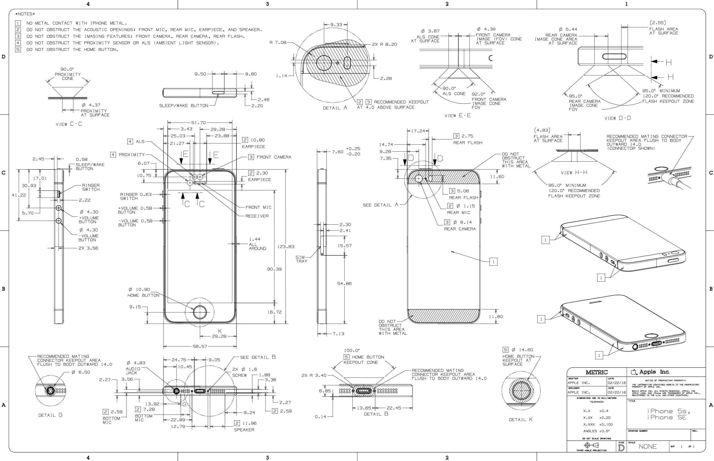
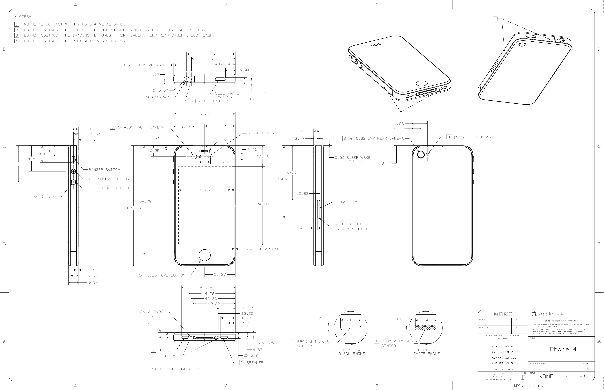

【多图警告】相信大家都有自己学过SolidWorks的基本绘图方法了，现在给大家讲解一个稍微有点规模的实物绘制三维模型实例，我会在实例中说明一些规范性要求以及一些实用的方法。

<!-- More -->

零件的范例模型会在实例中发出来。希望需要学习三维制图的同学一定跟着实例讲解一步一步动手操作，在绘制实例的过程周了解课程或者网络资源上讲述的画图功能的综合运用方法，真正掌握灵活的绘图技巧。

## 实例：iPhone 5

点击下载→[范例模型](三维绘图01-零件还原\iPhone 5.SLDPRT)

请安装[SolidWorks 2016](https://mp.weixin.qq.com/s?__biz=MzIwMjE1MjMyMw==&mid=2650199099&idx=3&sn=a5ba516295d46084000fdfe60b657e5f&exportkey=AxGu%2FIcqIOMfR5x%2Bi91P2aQ%3D&pass_ticket=gg3UwSJIdyvqPuA%2F5cXd9W%2FrH8eSgfM%2FOG5Y6WND07td9oVNcWW2XkmMhjeZJcWc)或以上版本查看

iPhone 5相信很多用过的同学手上都有实物，如果你有卡尺角度尺之类的量具的话可以自己掏出旧手机打开SolidWorks尝试着画一下。当然一定是有人没用用过的（比如我）。所以我看的是图纸和网上的图片。

拿到图纸以后首先思考如何开始这个零件的绘制：

- 这台手机近似于一个立方体的形状，所以我们可以从一个立方体开始增加细节；
- 手机周围的孔与按钮是许多拉伸凸台与拉伸切除；
- 手机上有许多按钮是槽口形状，可以直接在草图中绘制；
- 手机表面的光泽效果来源于透明件，可以在模型中复制这个效果；
- 手机的摄像头内部结构复杂，如何简化从而使用最少的特征还原效果；
- 手机的表面有许多接缝和分色，如何还原这个效果。

进行了以上甚至更多思考之后，我们开始一面一面的将这台手机还原出来。

## 三维建模

### 正面

首先起形，读到图中手机主体部分最外廓的信息，我们绘制出主体凸台，并添加圆角R9.15；

然后加上两面的倒角；

然后使用`特征->曲线->分割线`特征将手机的屏幕，听筒，光探头和前摄轮廓画来；

↑由于图纸上并没有确标出光探头的孔径，这里使用目测估算。

然后我们将HOME键周围画出0.1mm的缝隙，这条缝隙会在制作透明效果时体现作用。注意使用薄壁特征时切除应在圆环外侧。

#### 前置摄像头

现在我们画前摄，使用旋转切除的方式还原效果，首先建立基准面：为了建立经过旋转轴的基准面，我们在建立面之前先画一条草图线

通过草图线与平面就可以建立基准面了：选择`特征->参考几何体->基准面`建立基准面；

然后绘制如图所示草图，并旋转切除；

↑需要注意的是，我们为了避免报错，会十分注意**尽量将切除特征画成闭环切除**；

#### 正面玻璃护边

如果你仔细观察，iPhone 5的正面玻璃是镶嵌安装的，手机的正面周围会有凸起的护边，这也是图纸中标出的。护边的加入让手机厚度达到了7.60mm。事实上，从iPhone 4一直到iPhone SE正面都会有这一圈护边的存在。

首先拉伸画出护边环

然后使用圆角特征加入细节，还原实机

#### 电话听筒

根据实机观察，电话听筒的图纸只标出了它的倒角外扩，实际上内部结构还有一个内陷，我们一点点还原它。

首先我们现在玻璃的下层画出听筒的实际大小和听筒的下陷。听筒的实际大小可以使用草图绘制中的**等距实体**。

#### 正面玻璃

画完听筒之后，我们就可以给模型覆盖上正面玻璃，这块玻璃会覆盖摄像头与光感，但是会露出Home键和耳机孔。首先使用**转换实体引用**将需要填充玻璃的部分画出来，Home键处选择一薄壁缝隙的外沿

然后选择草图中的各部分，拉伸凸台。**注意在左边栏将“合并结果”的对勾√消去**，这样拉伸出来的实体不会与之前画出的主体融合在一起。

然后我们将听筒的倒角特征加上

这样一块前面板玻璃就画好了

#### Home键

如果你自己观察Home键结构就会发现它有三个特点

- 手指触摸的表面是一个弧面
- 再细看发现弧面下图案印在平面上，是一个类似于正面玻璃“镶嵌”的结构
- 经典的圆角正方形着色似乎与白色有分层效果

现在我们同样按照分层实现这个效果，首先与前置摄像头方法相同，我们画一个基准面

然后在这个基准面上，用一个草图将镶嵌层与透明层都画出来

使用下面的形状块将下层画出，注意轮廓的选择，以及不要勾选合并结果

然后使用分割线，将圆角正方形刻画在这个平面上

最后使用原有草图的上半块区域旋转出透明层，同样注意不要勾选合并结果。Home键就画好了。

正面的特征刻画完毕，我们来画侧面

### 侧面

#### 电源键

电源键在图纸上只有凸起厚度，实际特征我们需要在实机上比对目测。首先我们先使用草图中的槽口工具画出电源键，并拉伸出来

然后使用同一个草图对电源键外侧薄壁切除一定深度，做出缝隙效果

最后根据实机图，我们给他加上倒角

#### 静音拨码 & 音量键

根据图纸绘制出轮廓并拉伸出特征。由于拨码口圆角矩形图纸中没有，所以我们使用目测估计的办法画出深度合适的矩形口。

根据图纸给出的凸起画出拨码后，我们再次利用目测法给他们加上倒角。

观察发现，图纸标注的拨码位置为“静音”，拨码有红标注释，所以我们用分割线画上标记

利用草图槽口，我们画上音量键的“+”、“-“号

然后拉伸切除。注意这里为了实现效果，使用了**拔模**选项。拔模本意是指在拉伸过程中赋予主体的侧面一定的倾角，如果这个物体是通过注模成型，那么这个倾角会方便脱模取出。

”-“键方法相同，这样音量键绘制完毕

#### 卡槽

由于以单一零件绘制不涉及卡槽拆装，所以这里我们只要求外观符合。首先使用槽口与薄壁切除画出外侧接缝

然后目测估计取卡针孔的大小拉伸出插针孔，卡槽就画好了

#### lightning接口 & 耳机接口 & 底部麦克风 & 螺钉

首先根据图纸画出底部接口所用的凹槽。切除深度可以参考接口的机械标准。这里我们简化一下，只画出柱状深口。螺钉可以用分割线画出进行简化。

然后进行两组麦克风的开口：在草图中选择“**线性草图阵列**”可以将单个的圆进行队列复制。

↑需要注意的是，如果未勾选标注，草图阵列并不会自动加上尺寸约束。因此在**阵列完成退出时，草图还是蓝的**。因此在阵列结束后，我们需要通过额外约束限制草图。**所有草图都必须完全定义！**车队的制图任务有这一个标准。

切除麦克风口后，我们通过拉伸与倒角补完插口细节

最后我们通过**草图圆周阵列**与**样条曲线**进行**拔模拉伸切除**补完螺牙细节

↑需要注意的是，这里因为**样条曲线的复杂性**，仅对于样条曲线类的制图没有上述**完全定义**的要求。通俗地讲就是**只有样条曲线可以是蓝的**。

通过阵列特征将螺牙复制到另一个螺钉上，底部绘制完成

最后我们绘制背面

### 背面

iPhone 5的背面由三段构成，分别为玻璃板摄像头段，磨砂苹果标段，与玻璃板段。这两块玻璃板我们参考正面玻璃的绘制方法进行绘制。

首先通过切除与**镜像特征**画出玻璃背后的平面

#### 摄像头 & 背面麦克风 & 闪光灯

与正面相似，我们用分割线画出轮廓，分割后成为摄像头与闪光灯的金属外环

而后利用画前摄像头的方法，我们参考实机图片画出后摄像头复杂的层叠结构

然后拉伸切除出闪光灯与麦克风。麦克风的完整绘制方法与正面的听筒相同

最后我们给这两个面盖上玻璃，并添加倒角背面玻璃板部分就画好了

#### 苹果Logo

苹果标是由很多具有斐波那契数列关系的圆弧组成的。首先用整数半径的圆进行苹果标的作图。由于在一个草图上绘制，图形与约束非常复杂，大家在画复杂草图过程中不要做幅度太大的操作。每做一步先确认约束好了再画下一步，这样能够极大程度避免严重的定义冲突。尽量减小定义复杂导致图形画乱或软件崩溃的风险

第一个苹果标草图完成后，先使用另一个草图进行转换实体引用，再做缩放和移动操作，这样可以极大程度避免过于复杂的草图出现未知定义错误

#### 天线

使用分割线将苹果标画在背板后，再使用分割线画出侧边天线白条

至此，iPhone 5的建模部分全部完成

## 质量属性

画完三维图纸后，我们应该赋予零件质量属性，这样零件就可以在装配的时候体现质量，整车质量也就可以进行准确估算。

质量属性菜单位于`评估->质量属性`

大家可以看到，质量属性功能可以根据零件密度计算零件质量，这是大多数机械零件的质量评估方法。

- 机械零件可以通过赋予零件材料属性，这样不仅可以输出零件的质量，还可以给零件附带材料属性，这样就可以使用SolidWorks插件进行简单的有限元分析

然而对于很多整体购买的装配好的电子元件，我们是以单一零件形式画图的，这样就不能通过密度计算质量。

所以我们就使用质量属性的`覆盖质量属性`选项，这样就可以直接设置材料的质量，质心位置，密度等信息。

iPhone 5的质量是112g，所以我们在编辑界面输入

点击`确定`后，模型就被赋予了覆盖质量属性了。

## 着色与渲染

建模完成后，我们对模型进行上色。上色工具在SolidWorks外观选项中，相信大家已经有所了解。外观我就不做细节讲解了，大家参考我发的范例模型就能够明白。

模型的外观由**颜色、纹理、光泽度、发光度、透明度**等属性组成。在进行外观操作的过程中大家需要注意几点

- 着色面可以选择**零件**、**实体面**、**曲面**与**特征**等。大家需要清楚这些定义；
- 着色过程中对不同面的选择可以实现一些现实外观效果。譬如之前提过的**Home键**颜色的层次感。
- 由于不少电脑不能做到实时渲染，部分特征的点选过程可能看不清楚，大家可以灵活一点。比如先用看得清楚的颜色着色完再换为实际颜色。
- SolidWorks自带有许多材质。大家在着色过程中可以开启PhotoView 360渲染工具插件通过预览查看着色情况，对着色做细致调整，力求真实。

上述操作的具体方法大家可以查阅网络资料，这里就不赘述了。给大家的范例模型是银色的，大家可以看下范例模型的着色方法以及渲染效果。

## 任务

当然，作为一篇教程，最后给想学三维制图的同学布置一点简单的小任务：

不会做可以积极请教老队员哦（笑

### 【任务·简单】

- 参考实机（图片），将范例模型颜色更改为
  - iPhone 5 黑
- 跟随范例自主建模并着色，独立完成一台
  - iPhone 5 白

### 【任务·普通】

- 参考实机（图片）与图纸，将模型的Home键与后摄像头部分稍作改动，完成
  - iPhone 5s 深空灰
  - iPhone 5s 东北银
  - iPhone 5s 土豪金
  - iPhone SE 少女粉

### 【任务·困难】

- 参考实机（图片）与图纸，独立建模完成
  - iPhone 4 白
  - iPhone 4 黑

### 【任务·地狱】

- 画出自己的手机
  - 尺寸精度要求不高，没有卡尺的同学可以用塑料文具尺测量，**目测看不出明显的尺寸问题**；
  - 尝试称重，并赋予手机**质量属性**；
  - 给模型加上外观，并尽量使**渲染图**接近实机；
  - 画出你**能力范围内能表达的所有细节**，如果你愿意甚至可以画出碎屏的裂纹；
  - 端着下图这种形式的照片**夸一夸自己**（笑

