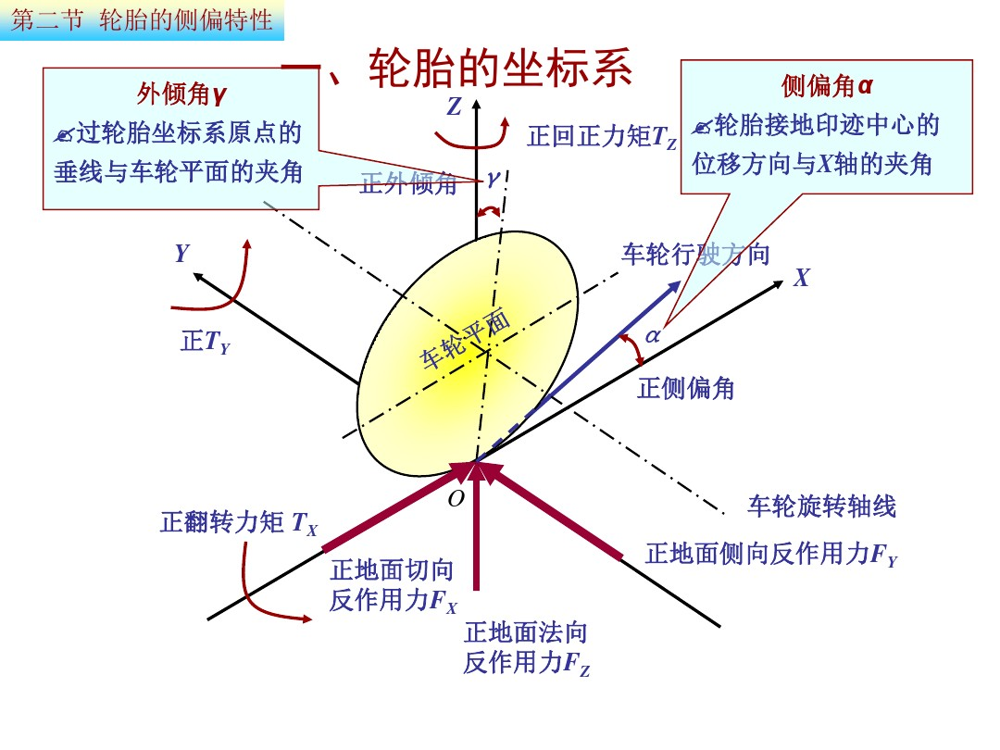
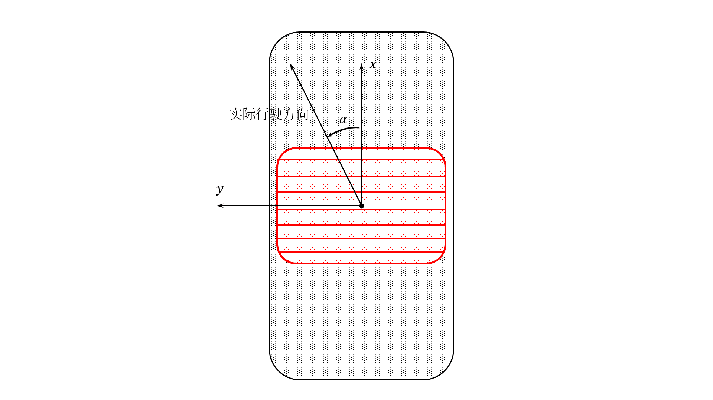
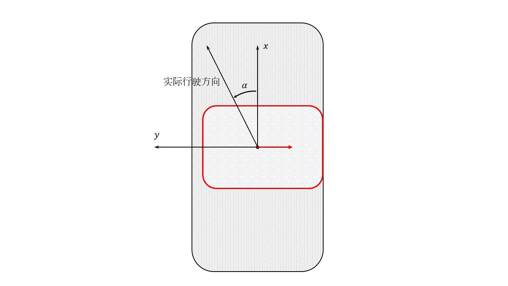
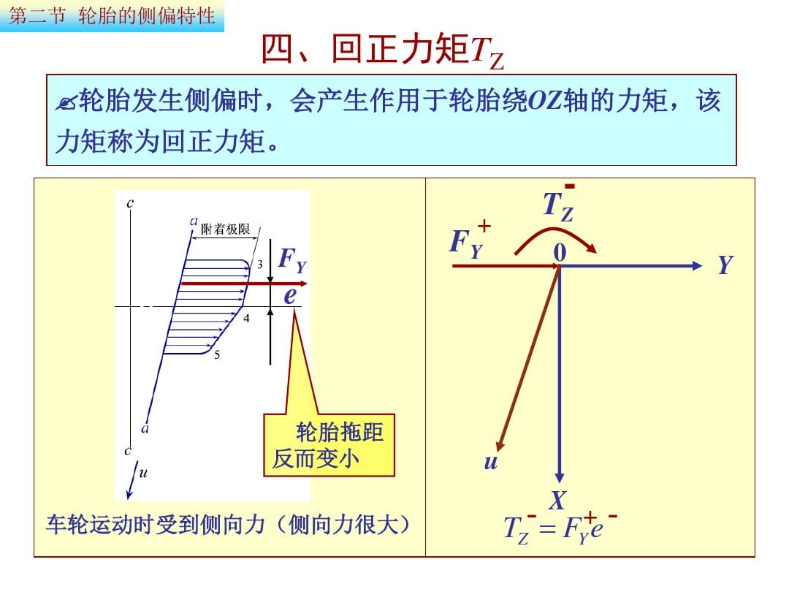
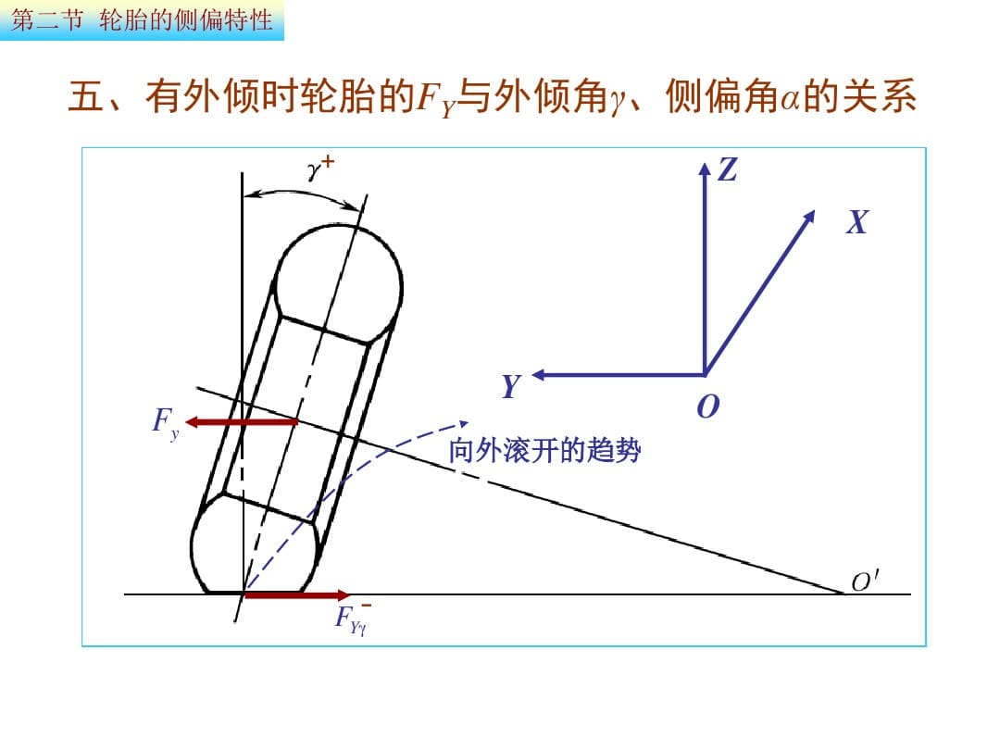
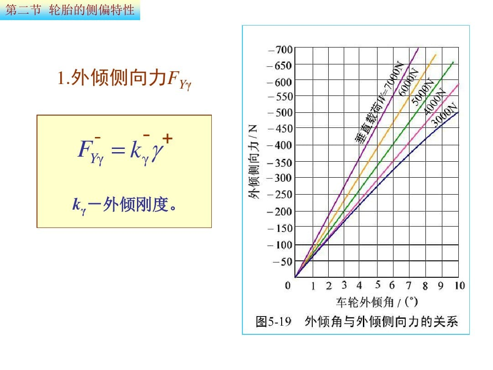
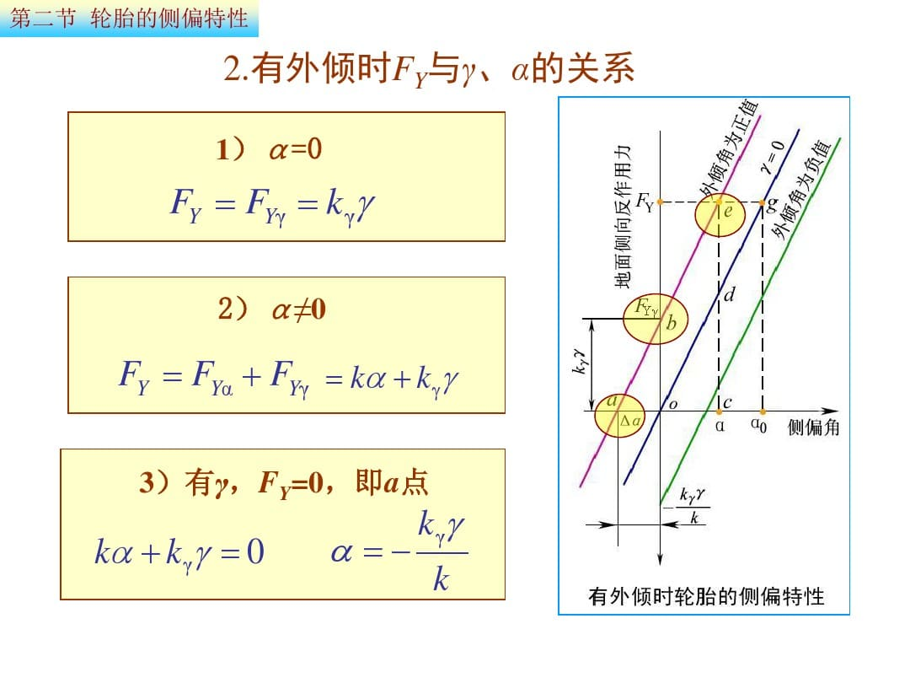

不知道大家有没有自己去学习了解一些汽车理论方面的知识，这个系列希望能够帮助专业不相关的同学更快入门吧，顺带扯一句我专业生物医学工程我也就看明白了（笑

<!-- More -->

为什么说轮胎最重要，相信大家在看简介的时候就已经有了一定的理解。赛车的全部抓地力都是由轮胎与地面不过巴掌大的接触面实现的。所以我们为了赛车的提升做的所有优化本质上都是为了提升轮胎对地面的最大摩擦力。因此在所有的子系统之前，我们必须了解轮胎。

> 轮胎是一台汽车上最重要的零件（没有之一）。
>
> ​																	——~~鲁迅~~

## 轮胎坐标系

为了清晰地描述车轮的运动模式，我们定义轮胎坐标系来描述轮胎的运动模式。

轮胎坐标系为一个以**车轮正前方**为x轴正方向，**与地面垂直的正上方**为z轴正方向的**右手系**。

在这个坐标系上我们可以清楚地表示一些轮胎的运动规律：

- 轮胎运动过程中受到切向，侧向与地面法向三个方向的地面反作用力***FX***，***FY***，***FZ***；
- 轮胎受到三个方向的力矩：切向称为**翻转力矩*TX***，地面法向称为**回正力矩*TZ***，侧向为**滚动阻力矩*TY***；
- 轮胎的滚动并不是圆柱体的滚动，轮胎滚动可能存在**外倾角*γ***；
- 轮胎的**实际行驶方向**可能与轮胎朝向产生偏角，这被表示为**侧偏角*u***。

## 附着力

赛车依靠轮胎受到的**地面的反作用力**运动，这就是所谓的“抓地力”，为了表示它的极限值，我们引入了**附着力**的概念。同时类比于摩擦系数，我们使用**附着系数**来称呼附着力与地面正压力的比值。
$$
F_{max}=F_Zφ\qquad φ=\frac{F_{max}}{F_Z}
$$
式中***Fmax***为附着力，***φ***为附着系数。根据力的合成分解原理，附着力与附着系数还可以分为**纵向(切向)**与**横向(侧向)**，分别对应最大的纵向与侧向的地面反力。与此同时，我们还使用**附着率*C***表示轮胎实际附着情况：
$$
C=\frac{F}{F_Z}
$$
可以看出附着率是一个变量，他与附着系数之恒间有***C ≤ φ***。

我们知道，优化赛车的根本手段是提高赛车轮胎的附着力。根据公式，附着力的提高有两种方法。

1. 提高**正压力*FZ***

   如果单纯使用增重提高正压力的话，车重带来的惯量会损失赛车的灵活性。尤其是有输出功率限制的FSAE比赛，增重会极大的影响赛车的直线加速成绩。所以最好地提升手段是使用空气动力学套件，利用**气动下压力**使赛车在速度较快的弯角获得更大的附着力。

2. 提高**附着系数*φ***

   附着系数是一个受到**地面质量、轮胎橡胶性质、轮胎花纹、轮胎接地面积、轮胎倾角、滑移率、侧偏角**等等很多物理属性影响决定的常量。
   
   因为它非常复杂，随着工况变化而变化，所以目前没有实时定量的技术水平，只能通过测试估计。但是工程上已经针对各种条件总结出了**附着系数的估计值与变化规律**。整个底盘系统绝大部分优化基于附着系数变化的规律，我们在之后的章节中细节分析。请大家牢记附着系数的概念。

## 轮胎的纵向运动

之前我们了解到，当车轮转矩过大时，轮胎的滚动状态就会被破坏而进入滑动状态，发生空转或抱死。现在我们来讲点细节。

### 现象

如果车轮是一个刚性的圆柱体，而地面是理想粗糙平面，那么车轮与地面之间的滚动就完全依靠圆柱面与地面之间的静摩擦力实现了，此时地面的**附着系数**完全等于**滑动摩擦系数**。这时车轮转矩对应到地面切向反力会有两种状态：

- 当车轮转矩输出到接触面面上的切向力小于附着力(***rT ≤ FXmax***)，此时车轮完全滚动。切向力等于这个转矩的输出。
- 当车轮转矩输出到接触面上大于附着极限(***rT > FXmax***)，此时车轮开始滑动，切向力达到附着力并保持在附着力上。

然而现实中的轮胎是充气的柔软橡胶表面，地面也是颗粒不平的粗糙平面。这个现实问题让我们不能用上述简单模型描述轮胎运动。实际上的轮胎运动过程中，由于橡胶的柔软，轮辋经由轮胎将力传导至地面的过程中，**轮胎接地面会产生微小的形变**。所以轮胎在加减速行驶过程中，胎面一直会与地面之间产生**微观上的滑移**。也就是说，轮胎在加减速行驶过程中，一直处于一种“**边滚边滑**”的状态。

为了描述这种状态，我们引入**滑移率**的定义：

### 滑移率

$$
s=\frac{u-u_w}{u}\times100\%=\frac{u-rω}{u}\times100\%
$$
式中***u***表示车速，***uω***表示车轮转动线速度，***ω***为车轮滚动角速度，***r***为车轮半径。滑移率表示**滑动摩擦在车轮纵向运动中所占的比重**。当车轮纯滚动时，***uω= u*** ，***s = 0***；当车轮抱死纯滑动时，***uω= 0*** , ***s =100%***；当车轮边滚边滑时，***u > uω*** ，***0 < s < 100%***。车轮滑移率越大，说明车轮在运动中滑动成分所占的比例越大。

滑移率能够描述轮胎因为**微观形变产生的滑移**（肉眼几乎不可见），也能够描述**轮胎的宏观滑移**（明显的车轮滑行）。经验告诉我们，一般当滑移率***s ≤ 0.2***，轮胎几乎不会产生宏观滑移；当这个数值超过***0.2***并逐渐增大，轮胎开始产生宏观滑移，并且微观滑移的强度会随着这个数值增大而减弱。这个规律的产生原因与橡胶轮胎的物理特性有关，我把有关内容放扩展吧这里不赘述。

现在我们来看看滑移率这个指标对赛车的影响

### 定性分析

由于**轮胎的变形程度受到地面纵向反力的直接影响**，即有地面纵向反力的产生意味着轮胎一定产生微观滑移。也就是说若将**滑移率**与车轮所受**纵向反力**作图，这条线将会**通过原点**。因此**滑移率能够在一定程度上直接反应轮胎所受纵向反力的大小**。

现在我们将滑移率直接设置为车轮的参数变量，这意味着如果此时有一个地面法向反力作用在这个带有滑移的车轮上，车轮将输出这个滑移所对应的纵向反力。
$$
F_X=f[F_Z,s]
$$
显然这个纵向反力是能够根据输入的法向力***FZ***与滑移率***s***唯一确定的。并且这个力应当是在这个状态下轮胎能够受到的最大纵向反力，符合**纵向附着力*FXmax***的定义。
$$
F_{X_{max}}=f[F_Z,s]
$$

所以若我们消去地面法向反力***FZ***的影响，就可以看出**滑移率*s***与**纵向附着系数*φX***之间存在的对应关系。这样我们就得到了**滑移率 - 纵向附着系数**的图像。
$$
φ_X=f[s]
$$

从这个图像里我们可以看出：

- 在非松质路面下
  - 随着滑移率提升，轮胎的附着能力基本符合**线性增长-峰值区间-衰减**的规律；
  - 附着系数峰值普遍出现在上文提到的**微观滑移与宏观滑移相结合**的区间。也就是说，最佳的加速或制动性能出现在轮胎肉眼观察将要出现滑动的临界点，符合客观规律；
  - 这个曲线会受到**路面条件**很大的影响，实际上附着系数本身就是一个受到很多因素影响的常量。
- 在松质路面下
  - 斜率变化平缓，超高的滑移率反而会带来更强的附着能力；
  - 后段附着能力提升来源于轮胎在松质土地中“刨地”的现象。这就是拉力赛中车手更多使用漂移技术的原因。如果你了解拉力，你会发现虽然在烂路赛段车手会漂移，但在铺装路面赛段车手还是会老实抓地跑的。

实际上轮胎的纵向力学性能受到很多因素的影响，这条曲线的参数还会因为轮胎的配方花纹气压等因素发生改变，在此不赘述。

以上就是轮胎纵向力学的基本规律，接下来讲轮胎的侧向力学规律。

## 轮胎的侧偏运动

轮胎侧向力学研究的是轮胎实际行驶方向与轮胎指向产生**侧偏角**的原因。

### 现象

与纵向运动采用相同的方式开始吧：我们再次假设轮胎是一个刚性圆柱，而地面是一个粗糙的理想平面。轮胎与地面的**侧向附着系数*φY***等于胎面的**摩擦系数**。此时如果车轮带有初速度，并且不受外力作用，车轮将匀速地沿着轮胎所指的方向滚动。此时如果给轮胎施加**侧向力*Fy***，那么轮胎会受到地面的**侧向反力*FY***的作用。按照这个逻辑，就可以估计出轮胎侧向运动的现象：

- 当**侧向力**未达到轮胎的侧向附着力(***Fy ≤ FYmax***)，轮胎在侧向上与地面仍然是静摩擦的状态，所以轮胎依旧沿着原有的方向直线匀速滚动；
- 当侧向力超过了轮胎的侧向附着极限(***Fy > FYmax***)，轮胎在侧向上开始了**滑动摩擦**，发生**侧向运动**。侧向运动与原有的滚动的合运动与轮胎的指向间产生了一个角度，我们称其为**侧偏角*α***，轮胎的行驶方向与实际指向不同，这就是轮胎的**侧偏运动**。

然而需要再一次强调的，现实中的轮胎是一个柔软的充气橡胶物体，地面也是颗粒不平的，所以上述理想模型肯定是无法描述实际情况的。侧偏运动的实际原理较之纵向运动在理解上稍复杂一些，我们另起一段↓

在地面侧向反力的作用下，如果轮胎是静止不动的，那么轮胎靠近地面的部分就会被“掰弯”

在这种形变下，**轮胎接地面的中心轨迹就会发生变化**，我们可以在图上清楚地看出来：**A0**到**A5**的位置在正视图上发生了明显的弯曲。如果此时轮胎滚动的话，很容易想象的是，**车轮的滚动路线就会沿着轮胎的中心线发生偏移**。一个柔软的轮胎在收到侧向力状态下滚动的时候，这种弯曲的状态是实时发生的，轮胎每转过一个点，就会随着这个轨迹发生偏移。因为这个现象，**只要轮胎受到侧向力的作用，它就会产生侧偏运动**。

理解了之前在纵向运动中描述的“**微观形变**”，你就会意识到，轮胎**侧偏角**与**滑移率**一样，与轮胎受到的侧向反力直接对应，**当轮胎受到侧向反力*FY*，它就会产生侧偏角*α***。因此我们也可以用**侧偏角一定程度上反应轮胎受到侧向反力的大小**。

### 定性分析

现在我们可以用熟悉的方式操作了：我们将侧偏角也作为车轮运动的参数变量，将**法向反力*FZ***、**侧偏角*α***作为输入，就可以直接得到轮胎所受到的**侧向反力*FY***的值：
$$
F_Y=f[F_Z,α]
$$
可以看到，这个侧向反力也是可以根据输入唯一确定的，我们把它直接换成**侧向附着力*FYmax***:
$$
F_{Y_{max}}=f[F_Z,α]
$$
然后我们将**轮胎的法向力*FZ***设为不同的定值，就得到了**侧偏角 - 侧向反力**的图像。
$$
F_{Y}=f[α]
$$

这个图像告诉我们：

- 与滑移率相同，侧偏角图像有一个**线性增长**的区间，而在到达峰值后会**很缓慢的衰减**；
- 由于轮胎侧向运动的速度与纵向运动速度之间存在着很大的差距，所以侧向反力的图像**与纵向附着系数的前段非常相似**。
- 图像因变量为侧向反力，所以随着**地面法向反力*FZ***的增加和减少，曲线的幅度会发生变化。

看到这里大家可能产生了一点疑惑：**为什么使用侧向反力作为因变量，而不是侧向附着系数呢？**

再稍加仔细地观察，上面的图像中随着正压力的变化，曲线的变化并不是线性的：**轮胎的侧向附着系数与轮胎所受的法向反力相关**。轮胎产生扭转变形引起的侧偏运动相较于纵向的滑移，对压力更加敏感，过高的压力会引起侧向附着系数的下降。

因此我们描述轮胎侧向性能的时候，一般不用侧向附着系数，而是**侧偏刚度*k***。在很多文献中的**附着系数*φ***指纵向附着系数。

### 侧偏刚度

侧偏刚度定义为轮胎所受**侧向力*Fy*与侧偏角*α*的比值**，单位为（***N/deg***)。在轮胎坐标系中观察规律，我们会发现侧向力与侧偏角的方向是相反的，所以**侧偏刚度是一个负值**。如果将它放在图像上，它是**侧偏角 - 侧向力**图像在原点的斜率。由于图像在到达峰值区域前仍然有相当长的一段线性区间，因此侧偏刚度还是能够很好地用来描述轮胎的侧向性能的。

现在我们看看**垂直载荷(法向力) - 侧偏刚度**的图像

↑很清楚地看见，对于同种型号的轮胎，随着法向力的增加，侧偏刚度有**线性增长 - 增速放缓 - 下降**的变化趋势。因此可以很自然地看出为什么在评价侧向性能指标时不使用侧向附着系数。在这个趋势下我们做出**垂直载荷 - 侧偏力(侧向反力)**的图像，它应该是这样的↓

这两幅图像告诉我们：

- 决定赛车过弯性能的本质还是轮胎，赛车轮胎本身更高的侧偏刚度决定了赛车能够实现远超民用车的过弯响应；
- 由于侧偏性能受到轮胎垂直载荷的影响，重量大的赛车在弯道上必然陷入劣势。因此**车子还是越轻越好**；
- 气动下压力能够在不提升车重的基础上提升过弯性能。

实际上如果垂直载荷无限增大，轮胎的纵向力学特性也会受到这样的影响。但是一般载荷无法增大到这个量级，而且在到达明显变化的区间之前，轮胎应该已经爆了（笑

### 附着椭圆

现在我们来看看侧偏运动与纵向运动之间的关系。之前我们了解过**g值圆**的概念。使用g值圆衡量车手驾驶水平时，我们会注意刹车 - 入弯的加速度转移过程。

纵向附着与侧向附着的共同点就是都伴随着轮胎的形变，**橡胶的变形张力极限**就是这些加速度极限的来源。所以轮胎能提供的最大纵向力与侧向力是关联在一起的。如果将轮胎的纵向附着力与侧向附着力做图，就会是如下的形式↓

在图上我们很容易就能看出：在不同的侧偏角下，侧向附着都有随着随着纵向附着增大而减小的趋势。这些图线的包络形成一个椭圆形，因此被称为**附着椭圆**。

如果你理解了以上内容，你就已经掌握轮胎行驶过程中两个分运动方向的基本运动形式了。现在我们了解一些其他的关键知识点吧。

## 回正力矩

我们转向时，会在方向盘上感受到促使方向盘回正的力，组成这个力的成分中，就有一部分来自于轮胎的**回正力矩**。

### 现象

在轮胎坐标系中，回正力矩被定义为地面法向的力矩。当轮胎侧偏运动的时候，在这个方向上就会有力矩使**轮胎倾向于与轮胎实际运动的方向对正**。

要解释这个力矩产生的原因，我们还是那句老话：**轮胎是一个柔软的充气橡胶圆柱**。由于刚性轮理想模型不会产生回正力矩，这里我们直接讲实际现象。

当在地面上滚动的时候，柔软的**轮胎与地面之间存在一个近似于椭圆或圆角矩形的接地面**。如果我们再细分，这个面可以被分为很多**与轮轴平行的线微元**。很好理解的是，在轮胎滚动的瞬态过程中(不存在宏观滑移)，这个接地平面最后段旧的微元离开地面，而最前端又有新的微元接触地面，循环往复。↓

现在我们给轮胎加上侧向力，于是轮胎开始有了侧偏运动，接地面就与正常滚动的轮胎相比发生偏移↓

上图中存在一个非常明显的问题：接地面前后端的偏移量是相同的,这是轮胎静止产生的。在轮胎滚动的过程中，由于接地面的前后端接地时间不同，**后端明显比前端接触地面时间更长，偏移距离也更长**，因此这个接地面在滚动时应该是一个接近平行四边形的状态↓

这样一来回正力矩的产生也就不难理解了：根据弹力的原理，**接地面后端更大的形变量显然会引起更大的轮胎回弹力**。在接地面上的**前后弹力差**形成了促使轮胎指向实际行驶方向的回正力矩。

### 定性分析

回正力矩与侧偏运动是同时存在的，我们使用侧偏角来关联轮胎产生的侧向附着力，也用侧偏角来关联回正力矩。先人根据经验整理出了如下图所示的关系↓

这张图像可以很清晰地看出：

- 回正力矩的变化趋势同样是近**线性增长 - 峰值区间 - 减弱**；
- 随着正压力的变化存在幅度变化；

更加仔细地观察，我们会发现，相较于纵向附着与侧向力，**回正力矩的下降非常剧烈**。究其原因还是它的发生机理：当轮胎接近附着极限时，接地面的后端显然会比前端更早突破极限并开始宏观滑移。当**后端回弹力不再增大而前端回弹力持续增加**，轮胎的回正力矩就开始下降，甚至在极端情况下达到负值。因此，有经验的车手能够通过方向盘力回馈的变化来判断赛车转向过程中侧向极限的逼近程度。

如果将接地面所受的力积分，我们会发现这个合力在数值上就是**侧向反力*FY***。它的作用点恰好能将这个合力分为数值相等的前后两部分，作用点与轮胎坐标系z轴的纵向距离被称为**轮胎拖距*e***。显然的对于**回正力矩*TZ***存在
$$
\vec T_Z=\vec F_Y\times \vec e
$$

## 外倾角

轮胎坐标系中还有一个定位输入量——外倾角。之前描述的现象中，我们都有“轮胎正着滚动”这样一个大前提，现在我们加入最后一个变量。

### 现象

轮胎在滚动过程中出现了倾角，那么它会开始转向倾倒的方向滚动，直到倒下为止。你可以试着滚一枚硬币，当它开始倾倒的时候也会出现这种现象。这是因为倾斜滚动的物体可以类比为一个滚动的圆锥或圆台，因为滚动半径的不同，必然会向着滚轴倾斜的方向转弯。这种现象也会被称为“滚锥效应”。

↑因此当轮胎指向固定而带着外倾角行驶时，外倾的偏转行驶趋势受到轮胎固定装置的**约束力*Fy***作用，会与地面之间产生额外的**侧向反力*FYγ***。这个力被称为**外倾侧向力**。

### 定性分析

我们将外倾角与滑移率或侧偏角一样，作为轮胎的一个参数输入轮胎的话，就会得到**外倾角 - 外倾侧向力**的关系↓

根据图像所示的关系，我们不难推断：

- 外倾角与外倾侧向力关系基本是线性的；
- 类比于**侧偏刚度*k***，我们将外倾角转化为外倾侧向力的系数称为轮胎的**外倾刚度*kγ***；
- 如果一个轮胎在滚动中同时带有侧偏角与外倾角，那么这两个变量带来的侧向力能够**叠加**。

所以如图所示↑，一个轮胎所受的**侧向力*FY***可以有如下关系：
$$
F_Y=k\alpha +k_{\gamma}\gamma
$$

## 总结一下

至此，我们基本了解了与轮胎有关的所有参数与变量。事实上在现代的工程设计过程中，轮胎的特性参数会根据一系列的测试建立数学模型，并封装到仿真工具中。实际操作过程中可能并不会接触到这些底层的问题。但是一定要有对这些现象的基本理解，因为这些关系本身就是很多设计思路的理论基础。

轮胎模型系统一般以如下的形式存在：

轮胎**魔术公式**模型是由代尔夫特理工大学的Hans B. Pacejka教授提出的一系列描述轮胎动态力学性质的数学模型，目前在工程界被广泛地使用。关于它的具体关系在此不做赘述，大家有兴趣的或者工作涉及仿真与轮胎模型时请自行查阅吧。

### 一些资源

- [James Sun - 从拟真向竞速游戏出发，聊聊关于赛车动力学的事（轮胎篇）](https://www.gcores.com/articles/93039)
- [汽车理论课件-汽车理论第五版-清华大学余志生 - 百度文库](https://wenku.baidu.com/view/34a4c450ef06eff9aef8941ea76e58fafab04598.html)
- [Hans B. Pacejka - wikipedia](https://en.wikipedia.org/wiki/Hans_B._Pacejka)
- [马语者 - 轮胎的魔术公式(Magic Fomula)模型](https://www.cnblogs.com/xpvincent/archive/2013/02/03/2890802.html)
- [汽车理论（清华大学） - bilibili](https://www.bilibili.com/video/av67716364/)

