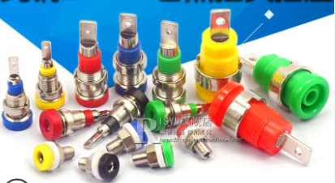

<!-- More -->

<video src="http://q4v73d4us.bkt.clouddn.com/fury教程/2020电气组寒假培训/第十讲.m4v" controls>您的浏览器不支持video标签</video>
## 测量点

- 需要在维护车辆时测量电控两端的电压

- 高压回路中没有电压测量点（安全考虑）

- 将电控的正负极引出至车身表面，并且保证安全

- 测量点回路由人体保护电阻和香蕉插座组成

- > 5.7.6 每个驱动系统测量点都必须用根据下表用限流电阻保护起来。禁止用保险丝保护驱动系统测量 ~ 92 ~ 点。电阻的额定功率的选择必须能够承受当两个驱动系统测量点短路时的电流。

人体保护电阻防止TS+和TS-之间的短路

## 香蕉插座

- 电气行业上的专用电压采集插座

> 5.7.3 驱动系统测量点应采用具有达到 CATⅢ-1000V 标准或更高标准的非黑色 4mm 电气专业绝 缘插头。

- 香蕉插座作为测量点与电控正负极相连，香蕉插头连接万用表

## DC/DC

- 将动力电池的高压转化为低压电，供大功率低压设备使用

